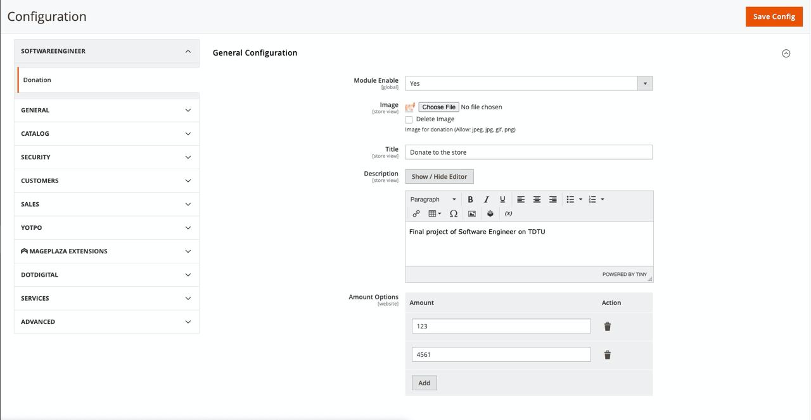
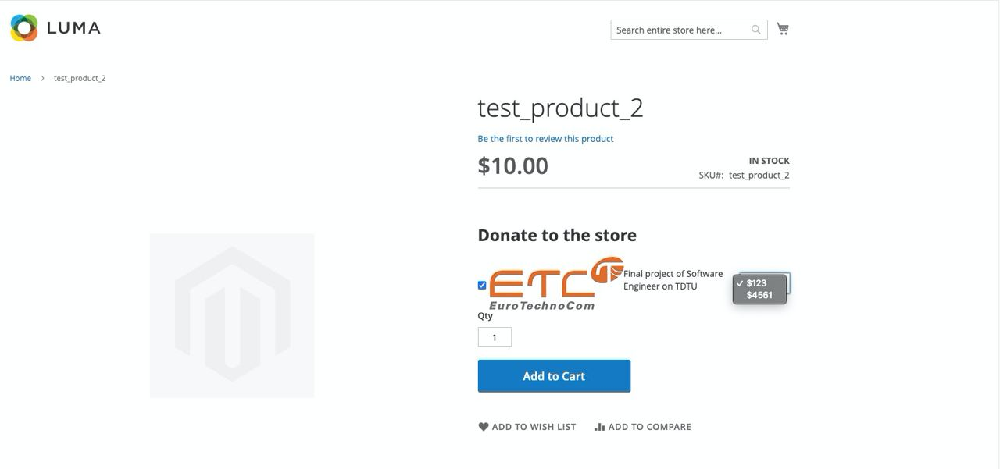

# Mage2 Module SoftwareEngineer Donation

    ``softwareengineer/module-donation``

 - [Main Functionalities](#markdown-header-main-functionalities)
 - [Installation](#markdown-header-installation)
 - [Configuration](#markdown-header-configuration)
 - [Specifications](#markdown-header-specifications)
 - [Attributes](#markdown-header-attributes)

## Main Functionalities
Final project of Software Engineer on TDTU

## Installation
\* = in production please use the `--keep-generated` option

### Type 1: Zip file
 - Create folder `SoftwareEngineer/Donation` on `app/code`
 - Unzip the zip file in `app/code/SoftwareEngineer/`
 - Enable the module by running `php bin/magento module:enable SoftwareEngineer_Donation`
 - Apply database updates by running `php bin/magento setup:upgrade`\*
 - Flush the cache by running `php bin/magento cache:flush`

### Type 2: Composer

 - Make the module available in a composer repository for example:
    - private repository `repo.magento.com`
    - public repository `packagist.org`
    - public github repository as vcs
 - Add the composer repository to the configuration by running `composer config repositories.repo.magento.com composer https://repo.magento.com/`
 - Install the module composer by running `composer require softwareengineer/module-donation`
 - enable the module by running `php bin/magento module:enable SoftwareEngineer_Donation`
 - apply database updates by running `php bin/magento setup:upgrade`\*
 - Flush the cache by running `php bin/magento cache:flush`

## Configuration 
(coming soon...)

## Specifications 
(coming soon...)

## Attributes
+ Can configure in backend. 

+ Show donation dropdown in PDP. 

+ Show fee in checkout cart, order. 
(coming soon...)
+ Show fee in invoice, creditmemo in backend and my account page. 
(coming soon...)
+ Show fee in Print order, order email. 
(coming soon...)
+ Sort, filter in order grid and invoice grid. 
(coming soon...)
+ Apply multiple product. 
(coming soon...)

