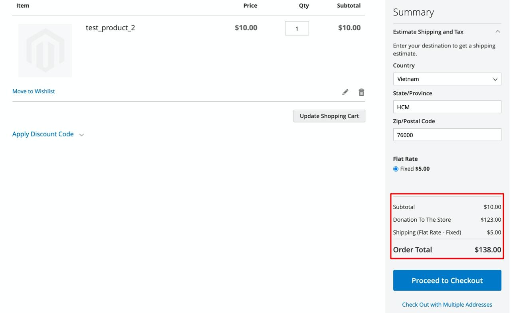
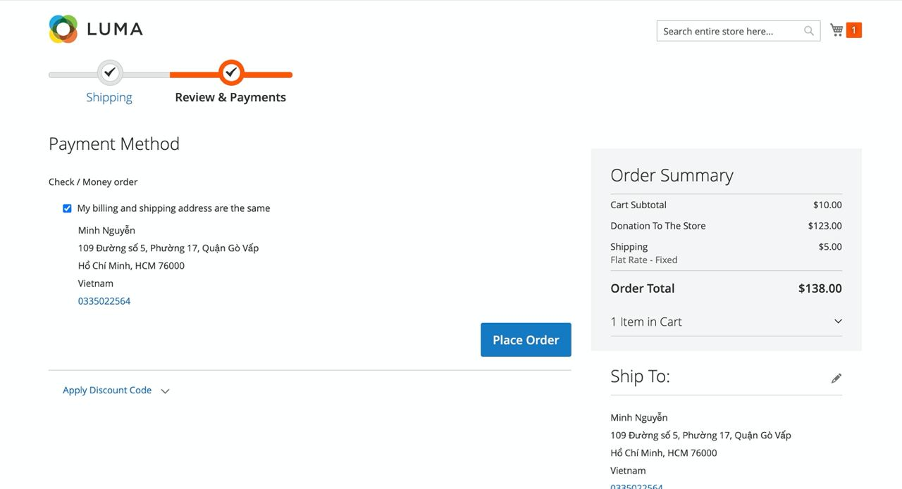
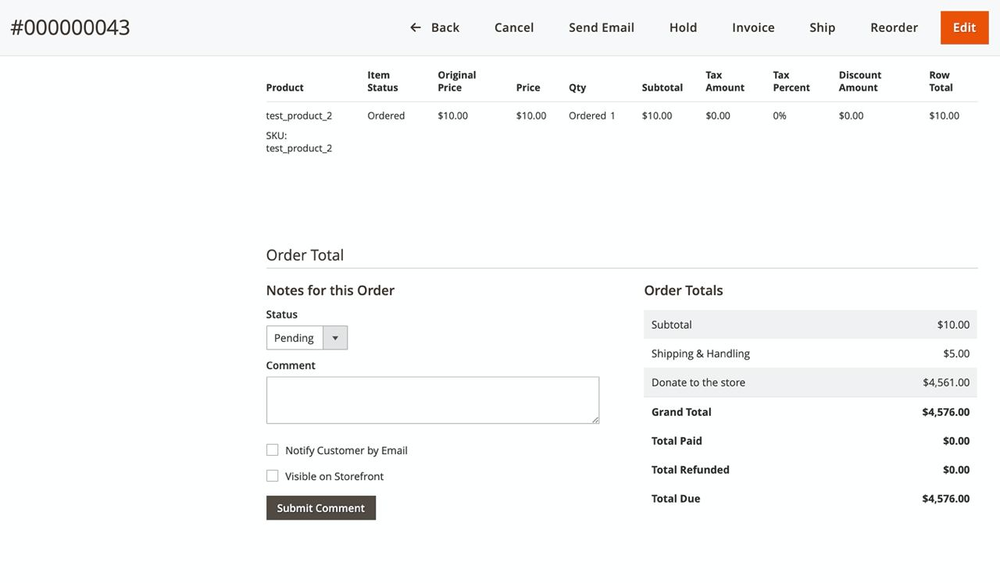
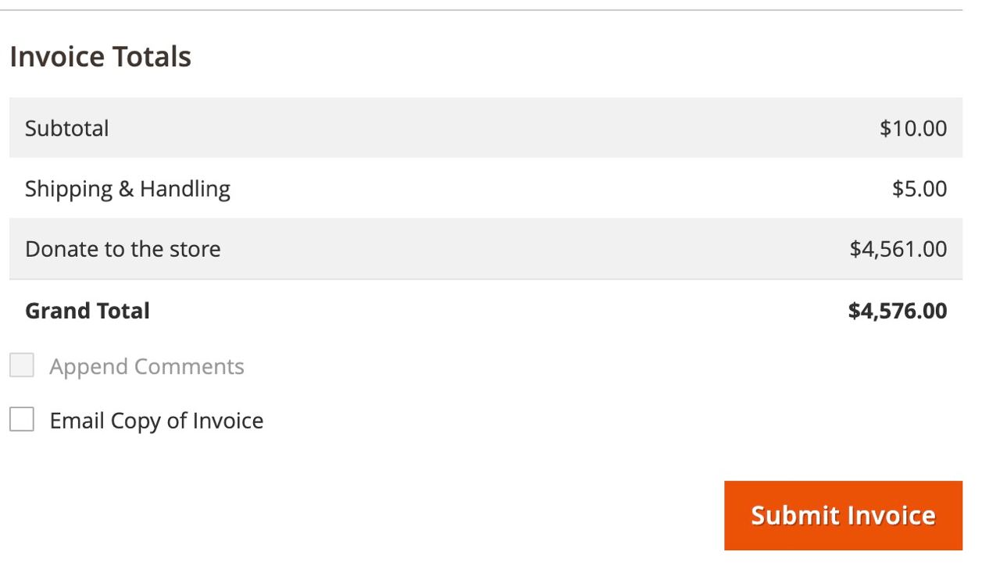
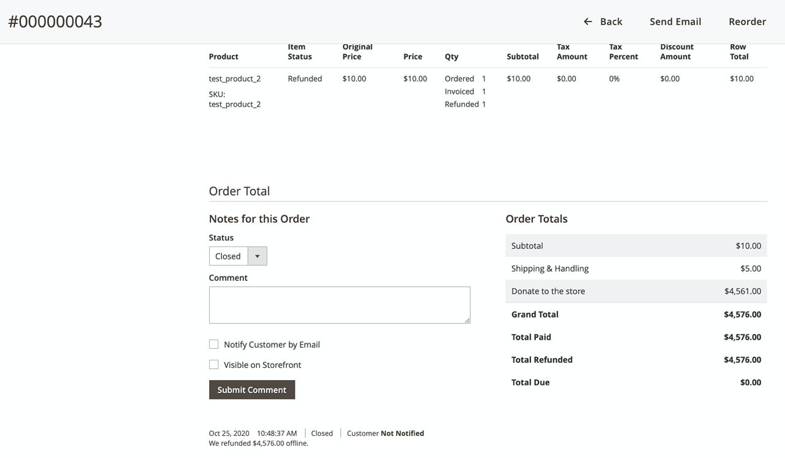
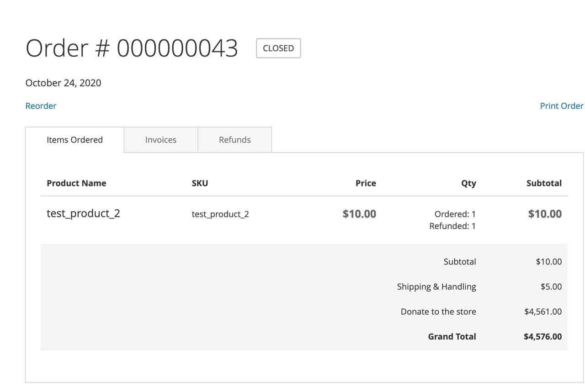
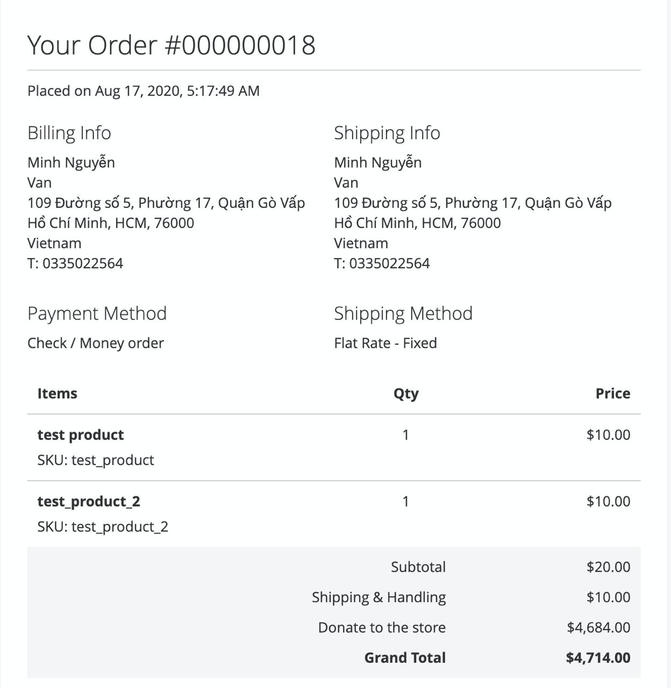

# Mage2 Module SoftwareEngineer Donation

    ``softwareengineer/module-donation``

 - [Main Functionalities](#main-functionalities)
 - [Installation](#installation)
 - [Configuration](#configuration)
 - [Specifications](#specifications)
 - [Attributes](#attributes)

## Main Functionalities
Final project of Software Engineer on TDTU.  
Follow team by Trello: https://bit.ly/2T8q5Pe

## Installation
 - Create folder `SoftwareEngineer/Donation` on `app/code`
 - Unzip the zip file in `app/code/SoftwareEngineer/`
 - Enable the module by running `php bin/magento module:enable SoftwareEngineer_Donation`
 - Apply database updates by running `php bin/magento setup:upgrade`\*
 - Flush the cache by running `php bin/magento cache:flush`

## Configuration 
(coming soon...)

## Specifications 
(coming soon...)

## Attributes
+ Can configure in backend. 

+ Show donation dropdown in PDP. 

+ Show fee in checkout cart, order. 

+ Show donation in invoice, creditmemo in backend and my account page. 

+ Show donation in Print order, order email. 

+ Sort, filter in order grid and invoice grid. 
(coming soon...)
+ Apply multiple product. 
(coming soon...)

